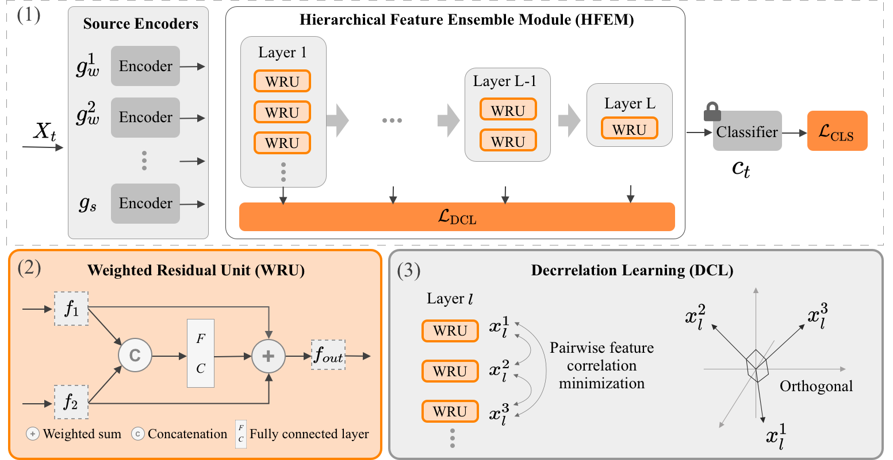

# Official implementation for 'Few-Shot Hypotheses Adaptation with Weak Source Models: An Initial Study'

### Framework:  



### Prerequisites:
- python == 3.6.8
- pytorch ==1.1.0
- torchvision == 0.3.0
- numpy, scipy, sklearn, PIL, argparse, tqdm

### Dataset:

- Concerning the **Digits** dsatasets, the code will automatically download three digit datasets (i.e., MNIST, USPS, and SVHN) in './data/'.

- Please manually download the datasets [Office](https://drive.google.com/file/d/0B4IapRTv9pJ1WGZVd1VDMmhwdlE/view) from the official websites, and modify the path of images in each '.txt' under the folder './data/office'.


### Training:
1. #####  Closed-set Few-Shot Hypotheses Adaptation (FHA) on the Digits dataset
	- USPS -> MNIST
	```python
	python lib/main.py \
    	--source_tasks usps \
    	--target_task mnist \
    	--data_size 28 \
    	--data_channel 1 \
    	--resize_size 32 \
    	--DA_type CDA
	```
	
2. ##### Closed-set Few-Shot Hypotheses Adaptation (FHA) on the Office dataset
	- Amazon -> DSLR
   	 ```python
    	python lib/main.py \
    	--source_tasks amazon \
    	--target_task dslr \
    	--data_size 224 \
    	--data_channel 3 \
    	--resize_size 256 \
    	--DA_type CDA
    	```

3. ##### Partial-set Few-Shot Hypotheses Adaptation (FHA) on the Office dataset
	- Amazon -> DSLR
    	```python
    	python lib/main.py \
    	--source_tasks amazon \
    	--target_task dslr \
    	--data_size 224 \
    	--data_channel 3 \
    	--resize_size 256 \
    	--DA_type PDA
    	```

